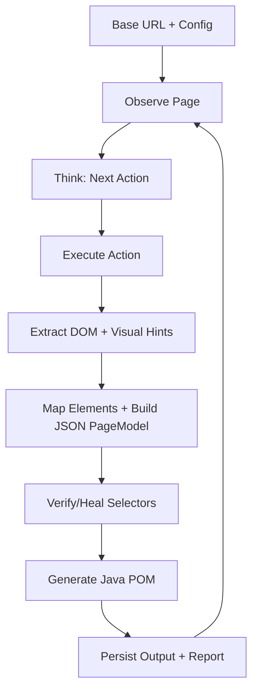

# Architecture Overview

## High-level flow

## Components

- **Navigator:** Executes actions and discovers links.
- **State Store:** Tracks visited signatures and graph edges.
- **Semantic Analyzer:** Converts compact browser context to structured models.
- **Self-Healing Verifier:** Tests and repairs selectors before persistence.
- **Java Synthesizer:** Produces compile-ready Java Playwright page objects.

## Design principles

- Token-efficient prompts from compact DOM context.
- Deterministic code generation through schema contracts.
- Guardrails first: domain boundaries, depth limits, and cycle detection.
