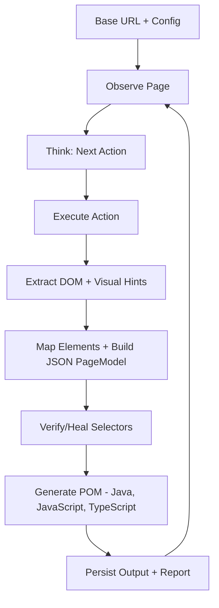

# Architecture Overview

## High-level flow

## Components

- **Navigator:** Executes actions, discovers links, and supports hybrid manual/automated workflows via **Interactive Mode** and **CDP Attachment**.
- **State Store:** Tracks visited signatures and graph edges to prevent duplicate modeling.
- **Semantic Analyzer:** Converts compact browser context to structured models with ranked fallback selectors.
- **Self-Healing Verifier:** Tests and repairs selectors against live DOM state before persistence.
- **POM Synthesizer:** Produces compile-ready Playwright page objects with configurable **Locator Storage** strategies.

## Design principles

- Token-efficient prompts from compact DOM context.
- Deterministic code generation through schema contracts.
- Guardrails first: domain boundaries, depth limits, and cycle detection.
- Configuration-driven output language with shared semantic model and generation pipeline.
